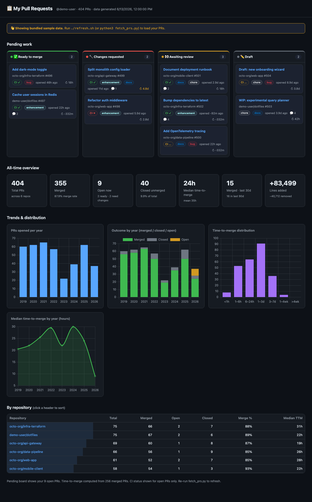

# 📋 PR Dashboard

A self-contained, **local** HTML dashboard for the pull requests *you* have
authored on GitHub. It shows your pending work organized by review status, plus
all-time statistics — merge rate, time-to-merge, per-year trends, and a
per-repository breakdown.

No server, no build step, no third-party services. It runs entirely from your
machine using the [GitHub CLI](https://cli.github.com/) you're already logged
into, and **your data never leaves your computer**.



> The repo ships with **synthetic sample data** so the dashboard renders
> immediately. Run the fetcher to replace it with your own PRs.

## What it shows

**Pending work board** — your open PRs, grouped into actionable columns:

| Column | Meaning |
| --- | --- |
| ✅ Ready to merge | Open, review **approved** |
| 🔧 Changes requested | A reviewer requested changes |
| 👀 Awaiting review | Open, no decision yet (review required / not started) |
| ✏️ Draft | Marked as a draft |

Each card links straight to the PR on GitHub and shows CI status, labels, age,
and time since last activity (stale PRs are highlighted).

**All-time stats**

- Total PRs, merged count, merge rate, closed-unmerged count
- Median & mean **time-to-merge**, plus PRs merged in the last 30 / 90 days
- Lines added / removed across all PRs
- Charts: PRs per year, outcome (merged/closed/open) per year, time-to-merge
  distribution, and median time-to-merge trend
- Sortable per-repository table with merge rate and median time-to-merge

## Requirements

- [GitHub CLI](https://cli.github.com/) (`gh`), authenticated: `gh auth login`
- Python 3.8+ (standard library only — no `pip install` needed)
- Any modern web browser

## Quick start

```bash
git clone https://github.com/<you>/pr-dashboard.git
cd pr-dashboard
./refresh.sh          # fetches your PRs, then opens the dashboard
```

Or do it in two steps:

```bash
python3 fetch_prs.py  # writes data.js
open index.html       # macOS — or just double-click the file
```

That's it. Open `index.html` in your browser any time; re-run the fetcher to
update.

## How it works

```
fetch_prs.py  ──>  cache.json  ──>  data.js  ──>  index.html + dashboard.js
   (gh API)        (source of        (what the      (renders, Chart.js
                    truth)            browser loads)  vendored locally)
```

- `fetch_prs.py` queries GitHub's GraphQL search API for `author:@me type:pr`,
  sliced by calendar year (the search API caps results at 1000 per query).
- Results are stored in **`cache.json`**, the local source of truth. It's saved
  after **every page**, so the fetch is **fully resumable** — if it's
  interrupted (or GitHub returns a transient 502), just run it again and it
  picks up where it left off.
- Merged/closed PRs are **immutable**, so once a past year is fully fetched it's
  marked complete and skipped on future runs. Only the current year and any year
  still holding an open PR are re-fetched — so repeat refreshes are fast and
  stay well under GitHub's rate limits.
- `data.js` (a single `window.PR_DATA = {…}` assignment) is regenerated from the
  cache. Loading it as a plain `<script>` avoids `file://` CORS issues, so the
  dashboard works by just opening the HTML file — no local web server required.
- The dashboard is plain HTML/CSS/JS. [Chart.js](https://www.chartjs.org/) is
  vendored under `vendor/` so it works fully offline.

## Privacy

This tool runs locally and talks only to GitHub's API via your own `gh` auth.

**Your PR data is never committed.** `data.js` and `cache.json` (which contain
your PR titles and repository names) are in `.gitignore`. The repository
contains only the tooling plus synthetic sample data — nothing personal.

If you fork this, keep that `.gitignore` intact before committing.

## Files

| File | Purpose |
| --- | --- |
| `index.html` | The dashboard page |
| `dashboard.js` | Rendering logic (buckets, KPIs, charts, table) |
| `fetch_prs.py` | Fetches your PRs into `cache.json` → `data.js` |
| `refresh.sh` | Convenience wrapper: fetch + open |
| `data.sample.js` | Synthetic demo data (no real data) |
| `vendor/chart.umd.min.js` | Chart.js, vendored for offline use |
| `data.js`, `cache.json` | **Your** data — generated locally, git-ignored |

## Notes & limitations

- The first full fetch of a long PR history makes many API calls and can take a
  few minutes; subsequent refreshes are quick thanks to the cache.
- GitHub's GraphQL endpoint occasionally returns transient `502`s under load —
  the fetcher retries with backoff and the cache makes it safe to re-run.
- CI status is fetched only for open PRs (it's not meaningful for old merged
  ones and keeps the fetch cheap).
- Time-to-merge is measured from PR creation to merge.

## License

MIT
